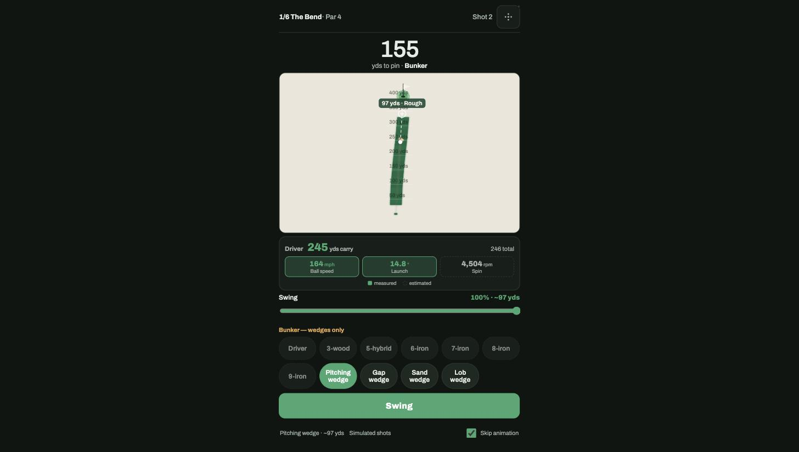

# Mulligan

[](https://github.com/MehulChau/Mulligan/actions/workflows/ci.yml)

A cheap DIY launch monitor turns real driving-range swings into a golf hole you play on your phone. The range session *is* the game session — every real swing is a turn.



## The idea, and the decision that shapes everything else

Full-flight radar tracking (the Trackman approach) isn't replicable on a hobby budget. So Mulligan doesn't try: it **measures launch conditions in the first couple feet of flight and simulates the rest**. A camera + IR strobe photographs the ball a few times in one long exposure; the gap between those images gives ball speed, and the slope of the line through them gives launch angle. Everything after that — the rest of the flight, where it lands, how it rolls out — is physics simulation, not measurement.

That single decision is the most interesting engineering decision in this project, and it shapes the whole architecture:

- **`packages/physics`** is a pure, dependency-free point-mass flight simulator (drag, Magnus lift, gravity). It knows nothing about clubs, devices, or games — feed it ball speed/launch/spin/spin axis, get back a trajectory. Calibrated against Trackman's own published PGA Tour averages (see `CLAUDE.md`'s M2b section for the sourcing and the fitting story, including two things that were caught wrong before shipping).
- **The measurement/estimation boundary is explicit, everywhere.** A `RawShotEvent` (what the device actually sends) only ever contains what a camera-and-strobe rig can physically measure — ball speed and launch angle today. Spin, spin axis, and start line are *estimated* (`enrichShot`, `estimateSpin`) until a real spin-measurement subsystem exists. Every value shown in the app is tagged `measured` or `estimated`, visually, in the HUD — no launch monitor game tells you which of its own numbers are real.
- **`ShotSource`** is the seam that makes this honest. It's a four-line interface (`start`/`stop`/`onShot`) that `SimulatedShotSource` (dispersed shots per club), `ManualShotSource` (type in exact numbers), `ReplayShotSource` (replay a logged session), and eventually a real device all implement identically. The game never knows or cares which one it's talking to. `docs/device-protocol.md` is the wire contract a real device implements against this seam — written precisely enough to build the device side from without reading this repo's source, and honest about where it's still underspecified.

Building it this way is also what let the game get built *before* any hardware existed: `SimulatedShotSource` has been standing in for a real Pi since the very first milestone, and the day a real device sends its first shot over the wire, nothing on the app side needs to change (verified live against real hardware — see `CLAUDE.md`'s M3 section).

## Run it

```
npm install
npm run dev
```

Opens the printed localhost URL. No hardware needed — Simulated mode is the default, and a full round is playable immediately.

**Play without hardware**, three interchangeable shot sources, switchable from in-app Settings:
- **Simulated** — dispersed shots per club (skill-profile-adjustable: beginner/regular/low-handicap), the default.
- **Manual** — type in exact ball speed/launch/spin/spin axis/start line. The harness for entering real device readings by hand before hardware exists, and for reproducing a specific shot exactly.
- **Device** — a real launch monitor over the wire protocol in `docs/device-protocol.md`, or `npm run mock-device` standing in for one (a real WebSocket server speaking the actual protocol, with deliberate misbehavior modes — malformed JSON, duplicate sequence numbers, dropped connections — for testing the app against a device that isn't behaving).

## Current status

Functionally complete pending real personal range data. The playable-hole loop, scoring, putting, penalties, persistence (a round survives a reload or a crash), left/right-handed and imperial/metric support, per-club stats and personal bests, and hardware readiness (a documented wire protocol, verified live against a real device's actual detection pipeline) are all built and tested — see `CLAUDE.md` for the full milestone history. What's left mostly isn't more engineering: it's a personal driving-range session (`docs/range-session.md`) to replace Trackman's published tour averages with this player's own numbers, closing the gap `CLAUDE.md`'s own "what's next" section documents honestly rather than pretending is already closed.

**Hardware**: a Raspberry Pi 5 + Global Shutter camera + IR strobe rig, inspired by the open-source [PiTrac](https://github.com/PiTracLM/PiTrac) project. Device-side code (the real strobe-photo detection pipeline, verified working against this app over the actual protocol) lives in a separate repo, `mulligan-device` — this repo never simulates ball flight, and that one never computes carry or knows about clubs; `docs/device-protocol.md` is the contract that keeps that boundary honest on both sides.

## Deploy

Pushing to `master` builds the app and deploys it to GitHub Pages via `.github/workflows/deploy.yml` — no account or hosting cost beyond what the repo already has. The production build uses `/Mulligan/` as its base path (`apps/web/vite.config.ts`, gated on a `GITHUB_PAGES` env var the workflow sets) since a GitHub Pages project page is served from a subpath, not the domain root; local `npm run dev`/`npm run preview` stay at `/`.

The deployed app is a PWA (offline-capable after first load, installable to the home screen) — see `docs/device-protocol.md` for why a GitHub-Pages deployment specifically **cannot** reach a real device over the local network out of the box, and the honest options for working around it.

## Architecture map

```
Mulligan/
├── packages/
│   ├── physics/       pure TS, zero deps -- the ball-flight model + calibration config
│   ├── shot-source/    clubs, RawShotEvent/ShotEvent + enrichShot, the four ShotSource
│   │                    implementations, the calibration harness
│   └── game/           hole data model, surface lookup, shot placement, scoring, putting
└── apps/
    └── web/            Vite + React + TS, canvas rendering -- the game itself
```

`docs/README.md` indexes the rest of the documentation. `CLAUDE.md` at the repo root is the full running history of every decision, dead end, and fix, milestone by milestone — the primary source if you want the whole story rather than a specific reference.
